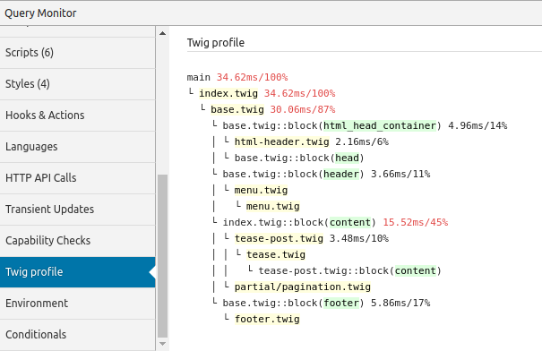

# Query monitor Twig profile

Displays [Twig](https://twig.symfony.com/) profiler output in [Query Monitor](https://github.com/johnbillion/query-monitor).
Automatically works with [Timber](https://github.com/timber/timber).



## Description

Find out which pages are slow, and why! Immediately see profiling information from Twig in your Query Monitor toolbar.

Automatically integrates with Timber.

## Installation

1. Install the plugin
2. Activate it
3. Check the 'Twig profile' tab in Query Monitor
4. Optimize your site

## Frequently Asked Questions

### Can I use it with other frameworks that use Twig?

Definitely. Just add a Twig profiler extension to your Twig instance and submit it to the collector.

```php
$profile = new \Twig\Profiler\Profile();
$twig->addExtension( new \Twig\Extension\ProfilerExtension( $profile ) );
$collector = \QM_Collectors::get( 'twig_profile' );
if ( $collector instanceof \NdB\QM_Twig_Profile\Collector ) {
	$collector->add( $profile );
}
```

## Development

Test the GitHub Actions workflow with [act](https://github.com/nektos/act):

See the documentation for the [setup-php action](https://github.com/marketplace/actions/setup-php-action#local-testing-setup)

```shell
act -P ubuntu-latest=shivammathur/node:latest
```
