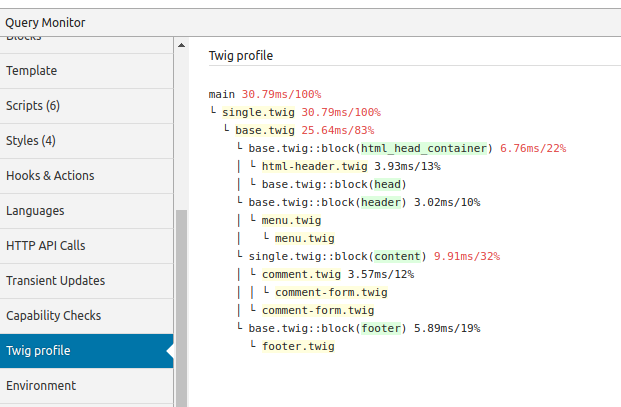

# Query monitor Twig profile

Displays Twig profiler output in Query Monitor. Automatically works with Timber.



## Description
Find out which pages are slow, and why! Immediately see profiling information from twig in your Query Monitor toolbar. 

Automatically integrates with Timber.

## Installation
1. Install the plugin.
2. Activate it.
3. Check the 'Twig profile' tab in Query Monitor.
4. Optimize your site.

## Frequently Asked Questions
### Can I use it with other frameworks that use twig?
Definitely. Just add a twig profiler extension to your twig instance and submit it to the collector.

```php
$profile = new \Twig\Profiler\Profile();
$twig->addExtension( new \Twig\Extension\ProfilerExtension( $profile ) );
$collector = \QM_Collectors::get( 'twig_profile' );
if ( $collector instanceof \NdB\QM_Twig_Profile\Collector ) {
	$collector->add( $profile );
}
```
